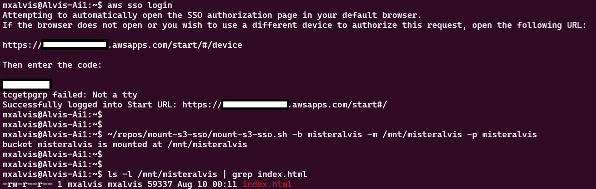

## mount-s3-sso
This bash utility provides a wrapper for the mount-s3 command to perform S3 bucket mounting via short-lived IAM Identity Center (AWS SSO) access

## Installing mount-s3
Follow the AWS documentation at: https://docs.aws.amazon.com/AmazonS3/latest/userguide/mountpoint-installation.html

## Usage Help
```Usage Help
Usage: ./mount-s3-sso.sh -b <bucket> -m <mount_point> -p <profile>
       ./mount-s3-sso.sh <bucket> <mount_point> <profile>
```

## Screenshot of usage

